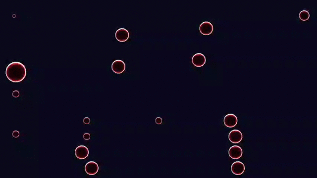
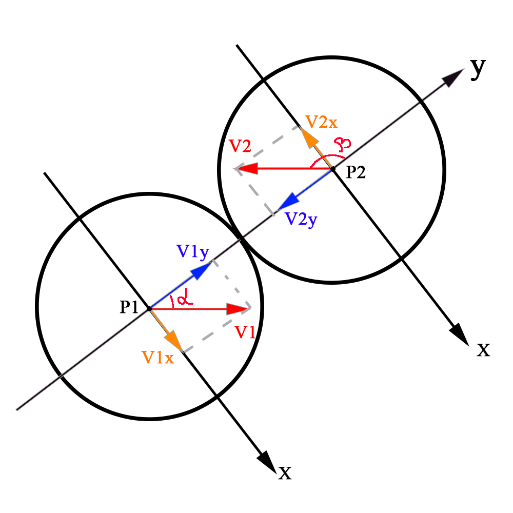
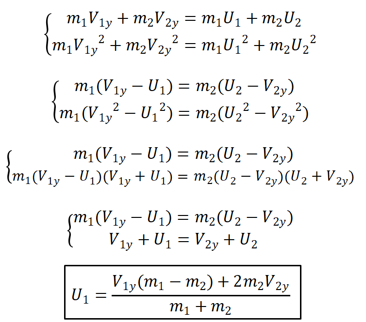
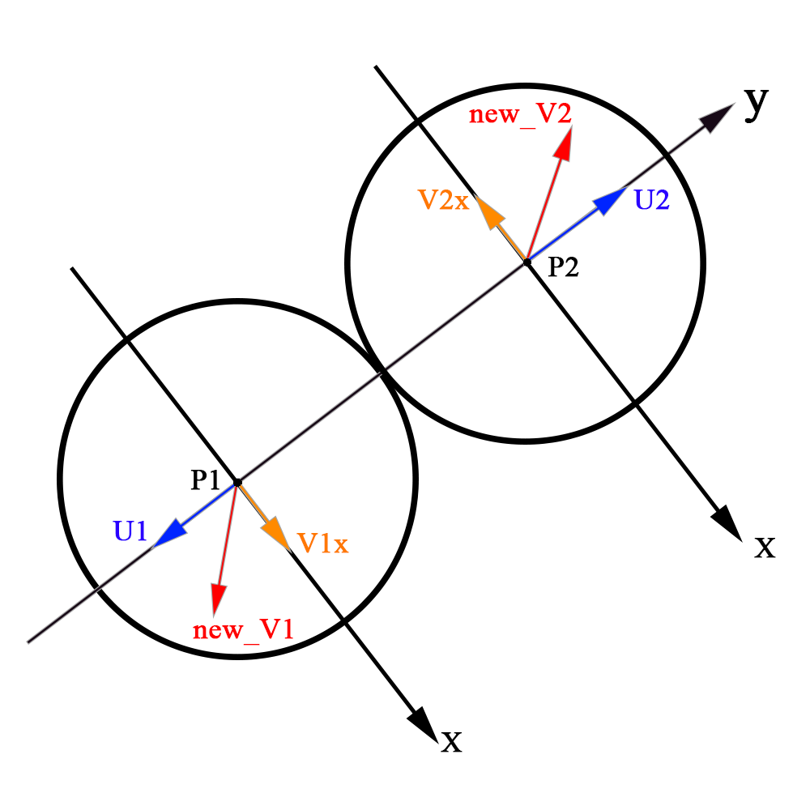
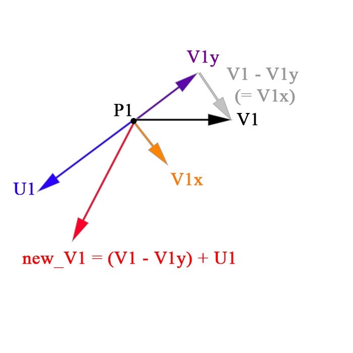
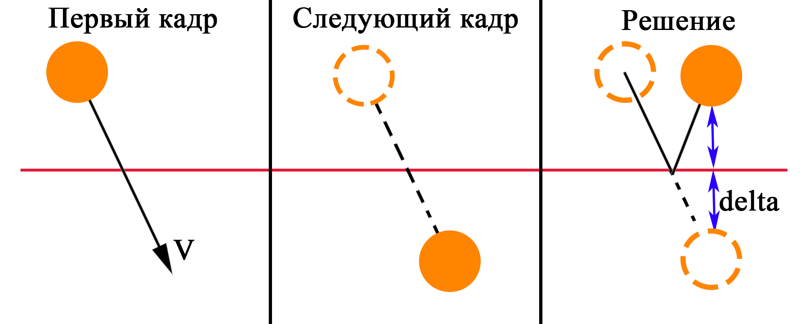

# Result



# Compilation

```
mkdir tmp
cd tmp
cmake ..
make
./collision
```

# Under the hood

## Elastic collision

Рассмотрим __абсолютно упругое соударение тел__ разной массы.

### Новая система координат

Для начала нужно перейти в более удобную систему координат:
* Ось __у__ проходит через центры шаров, соответственно вектор: __y = p2 - p1__
* Ось __x__ перпендикулярна оси __y__, её вектор можно найти через векторное произведение вектора __у__ и любого вектора перпендикулярного плоскости __ху__, например z = (0, 0, 1). Однако в моем решении ось __х__ и любые проекции на неё нам не понадобятся.

Вектор __у__ сразу же нормализуем, это сократит очень много операций!

### Проекция скорости

Теперь нужно спроецировать скорости шаров на ось у, это можно сделать через угол альфа, который находится через скалярное произведение __у__ и скорости, либо через проекцию вектора на вектор, оба способа приведут к одному результату:


Примечание: формула сократилась потому что мы нормализовали вектор __у__!



### Закон сохранения импульса (ЗСИ)

Вдоль оси __у__ будет работать __ЗСИ__, а так же __закон сохранения энергии__, а "иксовая" составляющая скорости никак не изменится, решаем систему:



Получаем модули новых "игриковых" составляющих скоростей, соответственно что бы задать им направление нужно умножить их на _нормализованный_ вектор _у_.



### Результирующая скорость

Внимание! Обещанный хитрый ход, который не требует операций с осью __х__.

Что бы найти результирующую скорость:
* Отнимем от вектора старой скорости вектор её проекции на ось __у__, соответственно мы таким образом получим "иксовую" составляющую.
* Прибавим к полученному вектору нашу новую "игрековую" составляющую.



## Tunneling effect

Эффект наблюдается на очень большой скорости шарика, может произойти так что он вылетит за границы карты или застрянет в другом шарике. Так происходит из-за того что количество кадров, отрисовываемых в секунду это конечное число:



Что бы избежать этот эффект достаточно при соприкосновении с границей:
* Инвертировать соответствующую составляющую скорости шарика (шарик отскочил от границы) как и раньше.
* Посчитать __delta__, на которую шарик перелетел за границу и "телепортировать" его обратно за границу на эту __delta.__

Шарики могут застрять друг в друге:
* Обнаружилась коллизия, однако когда шарик глубоко зашел в другой шарик (туннелирование).
* Посчиталась новая скорость.
* Один шарик не успел вылететь из другого.
* Снова обнаружилась коллизия, снова посчиталась новая скорость и так до бесконечности.

Для того что бы решить этот вопрос:
* Находим __delta__, на который один шарик влетел в другой: радиус первого + радиус второго - расстояние между их центрами.
* После того как посчитали новую скорость для шариков, смещаем один из шариков на вектор: delta * y.normalize().
